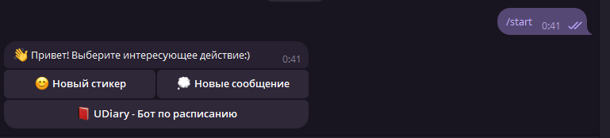
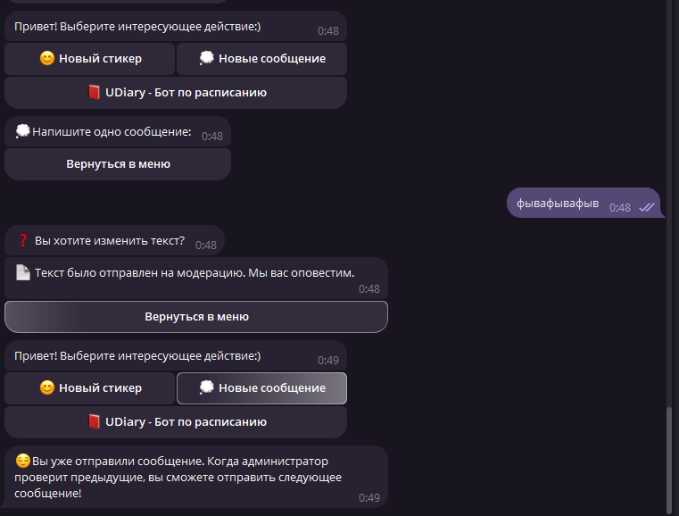
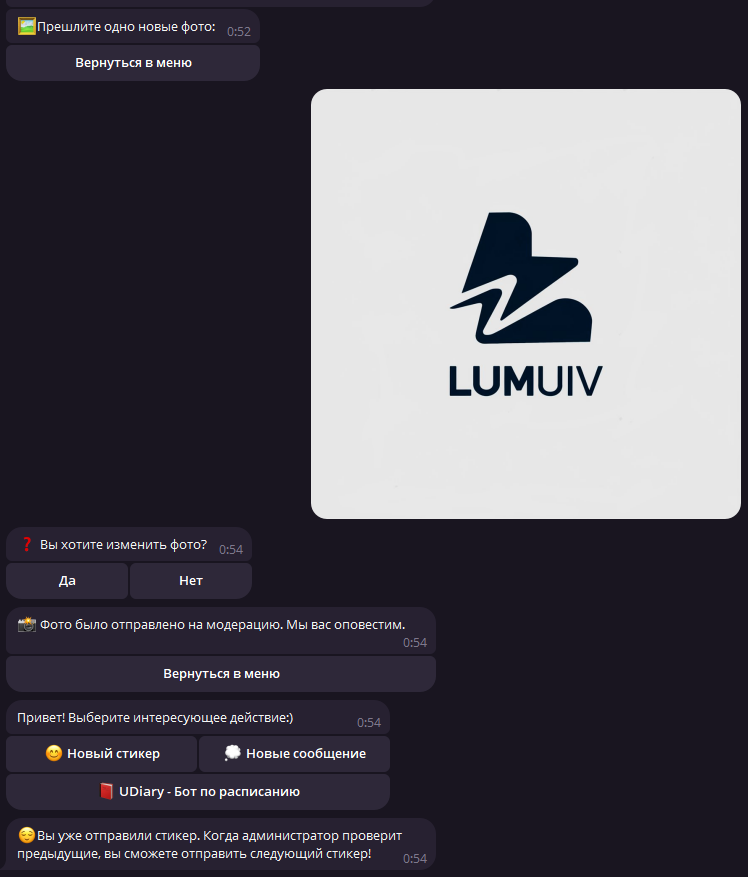
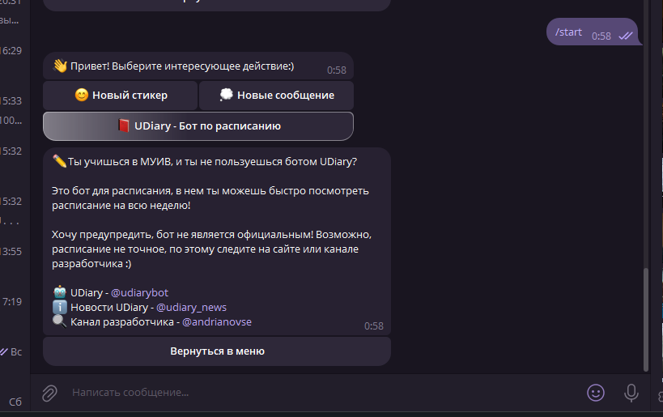
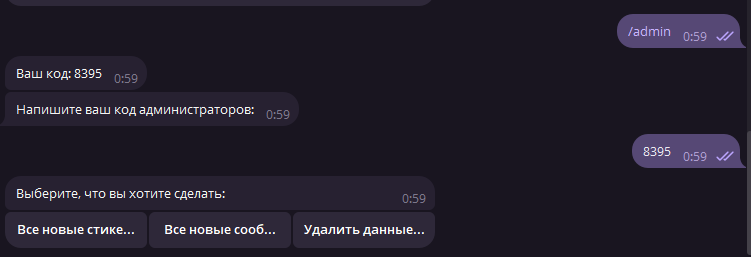

# 🔍 LuMuiv - Telegram Bot

Этот бот сделан для канала **ПОДЛУШИНО МУИВ**, чтобы помогать в подборке приколов и новых сообщений. В этом боте можно отправить сообщение и **стикер/картинку**. После одобрения администратора ваше сообщение попадет в канал, также вы можете **воспользоваться ботом для расписания**.

## 📌 Функциональность
-  Запустите бота в **Telegram** с помощью команды `/start`  


- Выбор сообщение: бот принимает сообщение и отправляет его в базу данных.


- Выбор стикера: бот принимает картинку и отправляет её в базу данных.


- Бот для просмотра **расписания**.


- Напишите эту команду `/admin`, и получите доступ к админке **(если вы добавлены в админы)**.


## 🗂️ Библеотки
❗``Если у вас PyCharm, благодаря файлу requirements.txt все библиотеки установятся автоматически.``

Asyncio
```bash
$pip install asyncio
```

Python-dotenv
```bash
$pip install python-dotenv
```

Aiogram
```bash
$pip install aiogram
```

 Aiohttp
```bash
$pip install aiohttp
```

## 📦 Структура проекта
- ##### `main.py:` Основной файл для запуска бота.
- ##### `.env:` TOKEN для запуска бота, он не должен показываться на GitHub.
- ##### `config.py:` Информация о пользователе (пароль и логин), он не должен показываться на GitHub из-за файла .gitignore.
- ##### `PhotoDB:` Сохранение фотографий для одобрения администратора.
- ##### `DataBase:` Папка с базами данных, на данный момент там сохраняются пользователи для общей базы.
- ##### `handlers:` Папка с основными функциями для бота (Callback, DataBase, FSM, Keyboard, Methods).
- ##### `README.md` Описание проекта.


[](https://t.me/vvlad_islovv) 
[](https://discordapp.com/users/1144549294813224960/)
[](https://vk.com/vvlad_islovv)